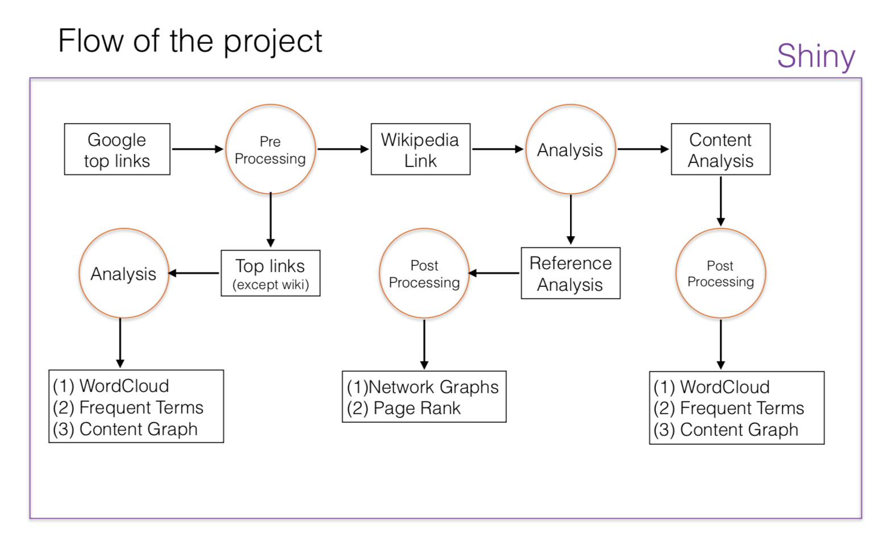
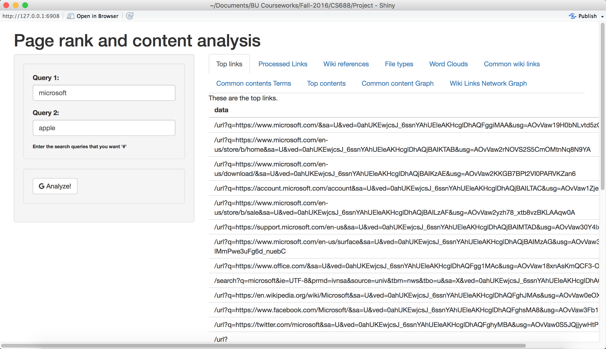
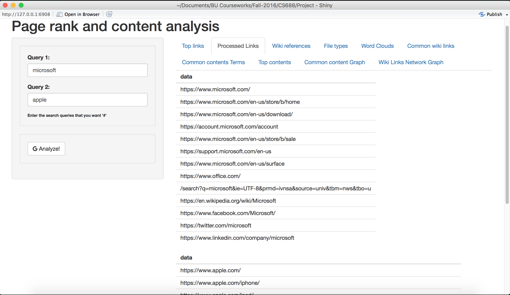
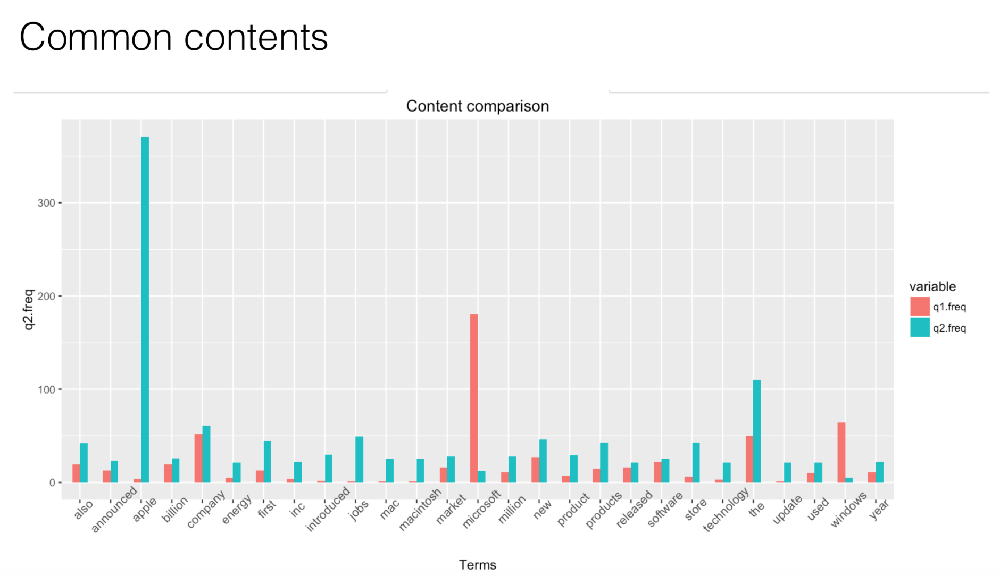
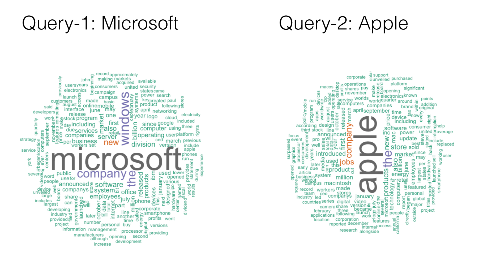
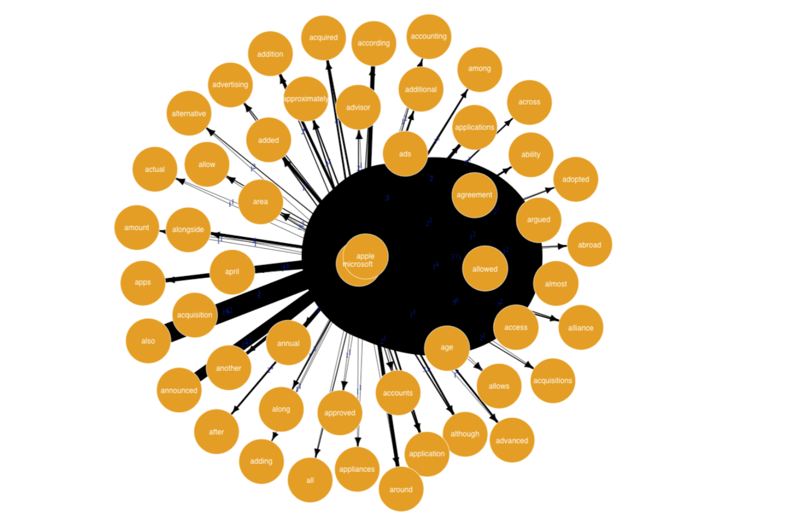

# Page Rank and Content Analysis

<small>This project is for CS688-C1 Web Analytics and Text Mining at BU </small>
This demonstrates the page rank concept and its implementation in R.

## Flow of Project

## Shiny Application
**Main page**

**Top Links**

## Results

The analysis is done between the two queries : Microsoft and Apple

### Content Analysis
##### Contents comparison

##### WordCloud for the two queries

### Network Graph

